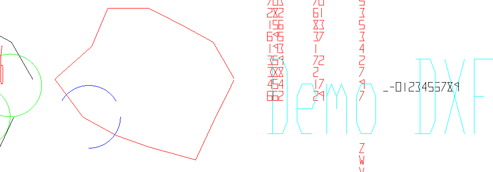

# DXF-Laser
DXF exporter tailored to laser cut.

Built on DXFExporter.jar from CADSoftTools (https://cadsofttools.com). 

The processing user needs to create 
1.“…/libraries/DXFLaser/library/DXFLaser.jar”, and then write “import pack.*;” to import the library.
2.“…/libraries/dxfExporter/library/DXFExporter.jar”.

typical codes:

DXF dxf = new DXF();

for (double[][] ps : arr)

   dxf.polyC2D(ps); //closed polygon

dxf.save(“.../Desktop/cut_digits.dxf");